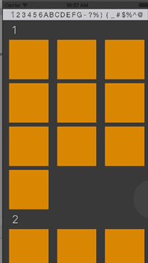

# Alphabet Slider

Provides an incremental slider, allowing the user to select from any arbitary values of your choosing--alphabet letters, numbers, values, or anything else.  Hook this up to a UICollectionView or a UITableView and use it as an index to quickly scroll between sections.  As a user scrolls through a table or collection, you can use delegate methods to update the value of this slider, which is a nice way of displaying the user's overall progress through the table or collection.



## Why would you want to use this?

* You want to have an incremental slider loaded with your own arbitrary labels
* You need an index for a UICollectionView
* You need an index for a UITableView, beyond the normal index that UITableView provides
* You need an index for some sort of UIScrollView


## How do you install this?

**Install via CocoaPods:**
`pod 'AlphabetSlider`
Make sure you have `!use_frameworks` declared at the top of your `Podfile`.

**Install via copy/paste**
Copy all files within the `AlphabetSlider` subfolder inside your project; see the example project.  You may need to add `AlphabetSlider` to your project's embedded binaries.

Regardless which installation method you choose, you may need to build the project once to get Xcode to recognize the new library.


## What can you do with this?

* Set your own fonts, colors, and offsets via Interface Builder
* Set your own arbitrary labels via the `alphabet` property, which accepts an array of strings.


## How might you implement this?

Explained via a working example:

1. `git pull` this project
2. Open the root `xcworkspace`, which contains the AlphabetSlider project, and an example project.
3. Build the AlphabetSliderExample project

Explained via instructions:

1. In the story board, drag out a UIView and place it somewhere inside your view controller.
2. Set this view's class to `AlphabetSlider` from module `AlphabetSlider`.
3. Drag out an IBoutlet into your view controller's code
4. In your view controller's `viewDidLoad` method, set the outlet's `alphabet` property to an array of any strings you choose.
5. Also in the `viewDidLoad` method, call the outlet's `addTarget` method to connect your custom function to the `ValueChanged` event.


## How would you use this as an index view for a UICollectionView, UITableView, or UIScrollView?

See the implementation in the example project, which is meant to be as simple as possible.

Essentially, you want two things to happen with an index view:
1. When the index view is touched or scrolled, scroll the collection view.
2. When the collection view is scrolled, update the index view.

This is accomplished by using `collectionView(willDisplayCell:)` and `your_slider.addTarget(forControlEvents:)`.

In a perfect world, that should be enough, but unfortunately the scroll view and its index have to share state in order to function in unison.  This is explained in the next section.

### Avoiding event collisions

There's a very good reason why there are not many UIScrollView index views on GitHub: the index and the scroll view need to work together and share state, since they are controlling the same scrollable area.

The solution is two properties on the index view: `userIsUsing` and `scrollViewIsUsing`.   Together, these properties act as a focus property, that tells the index view if the user has last touched the scroll view, or the index view, and it will stop sending events when it's not focused.

The other end of this, is that the scroll view needs to stop sending events to the index view, while the user is using the index view.

Here are important methods from the example:

```
// When a user is scrolling the collection, update the index view's value.
	func collectionView(_ collectionView: UICollectionView, willDisplay cell: UICollectionViewCell, forItemAt indexPath: IndexPath) {
		// This will update the index slider's value, but it won't send out the ValueChanged
		// event if scrollViewIsUsing is true.
		guard !indexSlider.userIsUsing else { return }
		indexSlider.value = indexPath.section
	}
	
	func scrollViewWillBeginDragging(_ scrollView: UIScrollView) {
		indexSlider.userIsUsing = false
		indexSlider.scrollViewIsUsing = true
	}
	
	func scrollViewDidEndDecelerating(_ scrollView: UIScrollView) {
		indexSlider.scrollViewIsUsing = false
	}
	
```


## What is on the horizon?

1. Tests!
2. Vertical index
3. More precise positioning and scrolling


####Enjoy!
